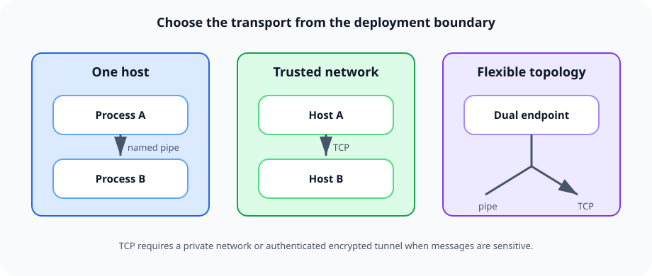

# Addresses and transports

An `Address` says how another queue can reach a `MessageQueue`. ServiceMq supports
named pipes for local processes, TCP for remote processes, and a dual address that
automatically chooses between them.



---

## Address constructors

| Constructor | Transport | Meaning |
| --- | --- | --- |
| `new Address("orders-pipe")` | Named pipe | Local pipe on this host |
| `new Address("server01", 8098)` | TCP | Resolve `server01` to an IPv4 address and use port 8098 |
| `new Address(8098, "orders-pipe")` | Both | Local host IPv4 plus a named pipe |
| `new Address("10.1.2.3", 8098, "orders-pipe")` | Both | Explicit IPv4 plus a named pipe |
| `new Address(ipAddress, 8098, "orders-pipe")` | Both | `IPAddress` plus a named pipe |

The address passed to `MessageQueue` is that queue's listening address. The address
passed to `Send` is the destination.

---

## Named pipes

Use named pipes when both queues run on the same machine:

```csharp
var destination = new Address("inventory-pipe");

using var inventory = new MessageQueue(
    "inventory",
    destination,
    @"D:\queues\inventory");
```

Advantages:

- No port allocation or firewall rule.
- The operating system provides local pipe identity and access control.
- Less network overhead than loopback TCP.

The pipe name must be unique among active queues on a host. ServiceMq constructs an
`NpHost` and `NpClient<IMessageService>` internally.

---

## TCP

Use TCP across machines or containers:

```csharp
var destination = new Address("queue01.internal.example", 8098);

using var inventory = new MessageQueue(new MessageQueueOptions
{
    Name = "inventory",
    Address = destination,
    ConnectTimeOutMs = 2_000,
    Storage = new StorageOptions { RootPath = @"D:\queues\inventory" }
});
```

`ConnectTimeOutMs` controls how long each new ServiceWire connection may take. A failed
connection does not lose a stored message; it enters the configured retry schedule.

The TCP constructor selects the first non-loopback IPv4 address returned for the host.
Use a dual constructor with an explicit IPv4 string or `IPAddress` when DNS or network
interface selection must be deterministic.

> ServiceMq's TCP wrapper does not expose ServiceWire's zero-knowledge endpoint. Treat
> TCP as an application network endpoint: restrict it with host firewalls, private
> networking, or a protected tunnel. See [Security](security.md).

---

## Dual addresses

A dual address lets one queue serve local and remote senders:

```csharp
var inventoryAddress = new Address(
    ipAddress: "10.1.2.30",
    port: 8098,
    pipeName: "inventory-pipe");
```

When the sender and destination have the same `ServerName`, ServiceMq chooses the named
pipe. Otherwise it chooses TCP. This gives local callers the cheap transport while
remote callers use the same logical destination.

---

## Immediate delivery with `Flasher`

`Flasher` sends through ServiceWire without an outgoing durable queue:

```csharp
using var flasher = new Flasher(new Address("checkout-pipe"));

Guid id = flasher.Send(
    primaryAddress,
    new CacheInvalidated { Key = "products" },
    secondaryAddress);
```

Use it only when immediate success/failure and fallback endpoints are more useful than
store-and-forward behavior. If every destination is unavailable, `Flasher` throws a
`WebException`; it does not retain the message for a later retry.

---

## Endpoint checklist

- Give every active pipe a unique name.
- Give every TCP listener a unique IP/port combination.
- Keep the queue's storage root unique as well; file storage takes an exclusive lock.
- Prefer explicit IP selection on multi-homed hosts.
- Keep `MessageQueue` alive for the process lifetime and dispose it during shutdown.

---

[← Back to the user guide](user-guide.md)
