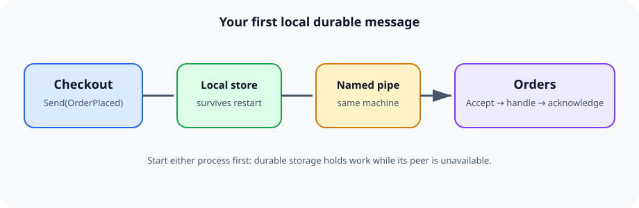

# Getting started

This walkthrough creates two queues in one console application. The same API works
when each queue lives in a different process.



---

## 1. Create a project

```shell
dotnet new console -n QueueDemo
cd QueueDemo
dotnet add package ServiceMq --version 7.1.0
```

ServiceMq uses ServiceWire internally; the application does not need to add a separate
ServiceWire package.

---

## 2. Define a message type

```csharp
public sealed class OrderPlaced
{
    public int OrderId { get; set; }
    public decimal Total { get; set; }
}
```

Typed messages are serialized with Newtonsoft.Json. Public properties and ordinary
POCOs work without ServiceMq attributes or base classes.

---

## 3. Create the receiver

```csharp
using ServiceMq;

var ordersAddress = new Address("orders-pipe");

using var orders = new MessageQueue(new MessageQueueOptions
{
    Name = "orders",
    Address = ordersAddress,
    Storage = new StorageOptions
    {
        RootPath = Path.Combine(AppContext.BaseDirectory, "data", "orders"),
        Durability = DurabilityMode.FlushToDisk
    }
});
```

`new Address("orders-pipe")` creates a named-pipe address. The `MessageQueue`
constructor opens its ServiceWire host immediately, so dispose the queue during an
orderly application shutdown.

If `RootPath` is omitted, ServiceMq uses the platform local-application-data directory:
`ServiceMq/<queue-name>`.

---

## 4. Create a sender and send

```csharp
using var checkout = new MessageQueue(new MessageQueueOptions
{
    Name = "checkout",
    Address = new Address("checkout-pipe"),
    Storage = new StorageOptions
    {
        RootPath = Path.Combine(AppContext.BaseDirectory, "data", "checkout")
    }
});

Guid messageId = checkout.Send(ordersAddress, new OrderPlaced
{
    OrderId = 42,
    Total = 19.95m
});

Console.WriteLine($"Queued {messageId}");
```

`Send` means “stored for delivery.” It does not wait for the receiver to process the
message. If `orders` is stopped, the outgoing record remains in `checkout` storage and
is retried after `orders` returns.

---

## 5. Receive and deserialize

```csharp
Message message = orders.Receive(timeoutMs: 5_000);

if (message == null)
{
    Console.WriteLine("No message arrived in five seconds.");
}
else
{
    OrderPlaced order = message.To<OrderPlaced>();
    Console.WriteLine($"Order {order.OrderId}: {order.Total:C}");
}
```

`Receive` removes the durable incoming record before it returns. For work that must not
disappear when a handler throws, use explicit acknowledgment:

```csharp
Message message = orders.Accept(timeoutMs: 5_000);
if (message != null)
{
    try
    {
        await ProcessOrder(message.To<OrderPlaced>());
        orders.Acknowledge(message);
    }
    catch
    {
        orders.ReEnqueue(message);
        throw;
    }
}
```

Configure `VisibilityTimeout` to requeue an accepted message automatically when a
worker neither acknowledges nor re-enqueues it.

---

## 6. Try a restart

1. Stop the `orders` queue.
2. Call `checkout.Send(...)` several times.
3. Dispose and recreate `checkout` with the same storage root.
4. Recreate `orders`.

The sender reloads its `.omq` records in filename order and resumes delivery. The
receiver similarly reloads unconsumed `.imq` records.

---

## Next steps

- [Addresses and transports](addresses-and-transports.md)
- [Messages and delivery](messages-and-delivery.md)
- [Storage](storage.md)
- [Retries and dead letters](retries-and-dead-letters.md)

---

[← Back to the user guide](user-guide.md)
