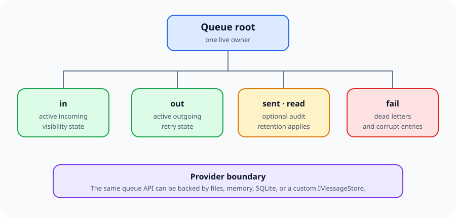
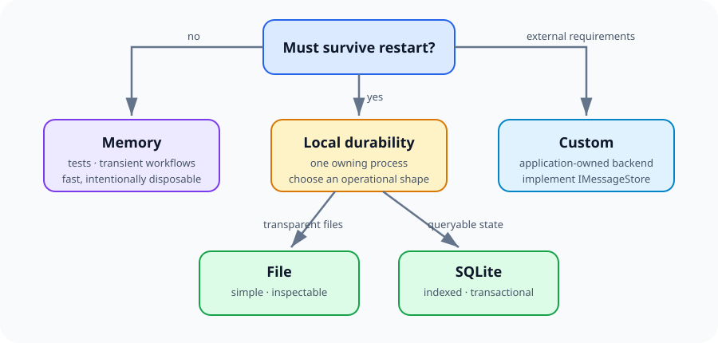

# Storage

Storage is part of ServiceMq's delivery contract. The outgoing record survives an
offline destination, and the incoming record survives a receiver restart until it is
consumed or acknowledged.



---

## Choose a provider



| Provider | Durability | Characteristics |
| --- | --- | --- |
| `FileMessageStore` | Disk | Default; atomic file-per-message records and readable audit files |
| `MemoryMessageStore` | Process only | Fast and isolated; all data disappears with the process |
| `SqliteMessageStore` | Disk | Optional package; indexed records and SQLite transactions |
| Custom `IMessageStore` | Provider-defined | Integrate another local store or application-specific engine |

### Default file provider

```csharp
var queue = new MessageQueue(new MessageQueueOptions
{
    Name = "orders",
    Address = new Address("orders-pipe"),
    Storage = new StorageOptions
    {
        RootPath = @"D:\queues\orders",
        Durability = DurabilityMode.FlushToDisk
    }
});
```

When `RootPath` is omitted, ServiceMq uses
`Environment.SpecialFolder.LocalApplicationData/ServiceMq/<queue-name>`.

Only one active `FileMessageStore` may own a root. An exclusive `.servicemq.lock` file
prevents two processes from silently corrupting the same queue.

### Memory provider

```csharp
Storage = new StorageOptions
{
    Durability = DurabilityMode.MemoryOnly,
    Provider = new MemoryMessageStore()
}
```

If `Durability` is `MemoryOnly` and no provider is supplied, ServiceMq creates a
`MemoryMessageStore` automatically.

### SQLite provider

```shell
dotnet add package ServiceMq.Sqlite --version 7.0.0
```

```csharp
Storage = new StorageOptions
{
    Provider = new SqliteMessageStore(@"D:\queues\orders\orders.db"),
    Durability = DurabilityMode.FlushToDisk
}
```

SQLite lives in its own package so applications using file or memory storage do not
receive SQLite native dependencies.

### Custom provider

Implement `IMessageStore` and supply one instance:

```csharp
Storage = new StorageOptions
{
    Provider = new MyMessageStore(),
    DisposeProvider = false
}
```

Set `DisposeProvider = false` when the application owns or shares that instance. A
provider must preserve keys, values, creation/modification times, atomic writes, moves,
purges, statistics, and flush behavior described by the interface.

---

## Durability modes

| Mode | File behavior | Intended use |
| --- | --- | --- |
| `FlushToDisk` | Atomic write plus a physical stream flush | Durable production queues |
| `Buffered` | Atomic write without forcing the OS cache to stable media | Higher throughput where a machine-level failure window is acceptable |
| `MemoryOnly` | Selects memory storage when no provider is supplied | Tests and transient work |

`FlushToDisk` protects against process loss and asks the operating system to flush the
record. Hardware, filesystem, and virtualization layers still determine the final
stable-media guarantee.

Call `FlushStorage()` before a coordinated snapshot or application-defined durability
barrier. `Dispose()` also flushes the provider after stopping queue workers.

---

## Capacity and backpressure

```csharp
Storage = new StorageOptions
{
    MaxMessages = 250_000,
    MaxBytes = 5L * 1024 * 1024 * 1024,
    FullBehavior = QueueFullBehavior.Block,
    FullWaitTimeout = TimeSpan.FromSeconds(10)
}
```

`MaxMessages` and `MaxBytes` apply to active incoming and outgoing records. Audit and
dead-letter data are controlled by their retention periods.

| Full behavior | Result |
| --- | --- |
| `Reject` | Throw `QueueCapacityExceededException` immediately |
| `Block` | Wait up to `FullWaitTimeout` for active storage to fall below the limit |
| `DropOldest` | Delete the oldest active stored record to admit the new record |

Prefer `Reject` or `Block` for business data. `DropOldest` is explicitly lossy and
cannot retract a message whose network delivery is already in flight.

---

## File layout

| Directory | Contents | Removed when |
| --- | --- | --- |
| `out` | Pending `.omq` records | Delivery succeeds or the message is dead-lettered |
| `in` | Unconsumed `.imq` records | Received or acknowledged |
| `sent` | Outbound audit `.log` files | `SentRetention` expires |
| `read` | Inbound audit `.log` files | `ReadRetention` expires |
| `fail` | Replayable `.dlq` records and legacy failure logs | Deleted, replayed, or `DeadLetterRetention` expires |
| `corrupt` | Records that could not be parsed at startup | An operator deletes them |

New records use a versioned, Base64-safe envelope. ServiceMq also reads the older
tab-delimited `.omq` and `.imq` formats. Writes happen through a temporary file followed
by an atomic replacement; orphan temporary files are ignored during enumeration.

---

## Auditing and retention

```csharp
Storage = new StorageOptions
{
    SentRetention = TimeSpan.FromDays(2),
    ReadRetention = TimeSpan.FromHours(12),
    DeadLetterRetention = TimeSpan.FromDays(30),
    CleanupInterval = TimeSpan.FromMinutes(15),
    SentAuditPayload = AuditPayloadMode.MetadataOnly,
    ReadAuditPayload = AuditPayloadMode.MetadataOnly
}
```

Audit payload modes are:

- `Full`: store metadata and payload.
- `MetadataOnly`: store identity, endpoints, timestamps, type, attempt, and payload size.
- `None`: do not create that audit record.

Cleanup runs on a timer even when the queue is otherwise idle. Call
`RunStorageMaintenance()` to run the same retention pass immediately. Use
`TimeSpan.MaxValue` to retain an area indefinitely.

---

## Encryption at rest

Storage protection is configured independently of transport security:

```csharp
byte[] key = Convert.FromBase64String(
    Environment.GetEnvironmentVariable("SERVICEMQ_STORAGE_KEY"));

Storage = new StorageOptions
{
    RootPath = @"D:\queues\orders",
    Protector = new AesStorageProtector(key)
}
```

The built-in protector uses authenticated AES encryption and accepts a 16-, 24-, or
32-byte key. Records without its version prefix remain readable, which permits an
incremental upgrade, but existing plaintext records are not rewritten automatically.
Back up the key separately from the queue. Losing it makes protected messages
unrecoverable.

See [Security](security.md) for the complete deployment checklist.

---

[← Back to the user guide](user-guide.md)
