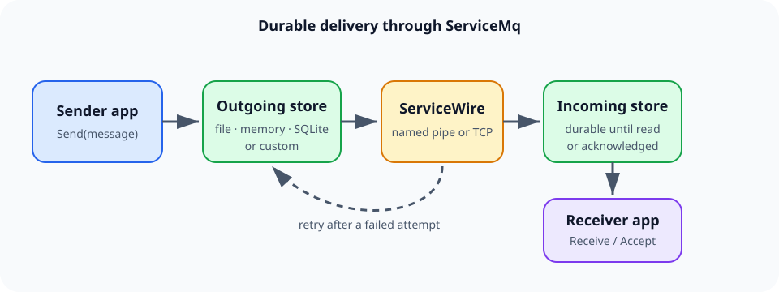
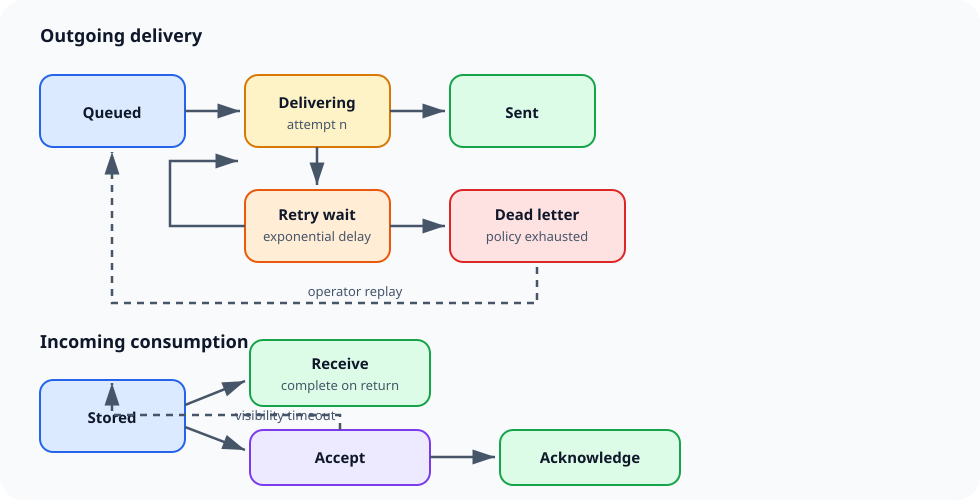

# ServiceMq User Guide

ServiceMq is an embedded, store-and-forward queue for .NET processes. It combines a
durable local message store with ServiceWire RPC: senders can continue accepting work
while a destination is unavailable, and receivers can choose immediate consumption or
explicit acknowledgment.



---

## Start here

| If you want to… | Read |
| --- | --- |
| Build a sender and receiver in ten minutes | [Getting started](getting-started.md) |
| Choose named pipes, TCP, or a dual address | [Addresses and transports](addresses-and-transports.md) |
| Send objects, text, and bytes correctly | [Messages and delivery](messages-and-delivery.md) |
| Choose and configure durable storage | [Storage](storage.md) |
| Control retry timing and recover failures | [Retries and dead letters](retries-and-dead-letters.md) |
| Monitor health, disk use, and corrupt records | [Operations](operations.md) |
| Encrypt records and reduce sensitive auditing | [Security](security.md) |
| Move from an older release | [Migrating to 7.0](migrating-to-v7.md) |
| Fix a queue that is not behaving as expected | [Troubleshooting](troubleshooting.md) |

---

## Install

```shell
dotnet add package ServiceMq --version 7.0.0
```

Install the optional provider only when SQLite is wanted:

```shell
dotnet add package ServiceMq.Sqlite --version 7.0.0
```

Both packages target `netstandard2.0` and `net8.0`. The core package depends on
ServiceWire 7.0 and does not pull in SQLite or native SQLite libraries.

---

## The mental model

A `MessageQueue` is both a sender and a receiver:

1. `Send` writes an outgoing record and returns its `Guid`.
2. A background worker delivers that record over a named pipe or TCP.
3. The destination writes an incoming record before confirming delivery.
4. `Receive` consumes and removes the record, or `Accept` leases it until
   `Acknowledge`.
5. A failed destination is retried. Exhausted messages enter the dead-letter store and
   can be inspected or replayed.



This produces **at-least-once delivery**. The same `Message.Id` may be observed more
than once if a process stops after the destination stores a message but before the
sender removes its outgoing copy. Business handlers should therefore be idempotent.

---

## Reference by type

| Type | Purpose |
| --- | --- |
| `MessageQueue` | Hosts a receiving endpoint and manages inbound/outbound queues |
| `MessageQueueOptions` | Top-level transport, memory, storage, and delivery configuration |
| `Address` | Named-pipe, TCP, or dual endpoint description |
| `Message` | Received envelope, metadata, bytes, and `To<T>()` deserialization |
| `Flasher` | Immediate non-durable send with optional fallback destinations |
| `StorageOptions` | Durability, capacity, retention, auditing, encryption, and provider |
| `DeliveryOptions` | Retry limits, age, delay, and backoff |
| `FileMessageStore` | Atomic file-per-message provider |
| `MemoryMessageStore` | Process-memory provider |
| `SqliteMessageStore` | Optional SQLite provider from `ServiceMq.Sqlite` |
| `IMessageStore` | Extension point for another storage engine |
| `AesStorageProtector` | Authenticated encryption for stored values |
| `QueueStorageHealth` | Counts, logical bytes, ages, and storage failures |
| `DeadLetter` | Inspectable summary of a failed outbound message |

---

## Working examples in this repository

The test suite exercises the same APIs shown in this guide:

| Source | What it demonstrates |
| --- | --- |
| [`BasicTests.cs`](../src/ServiceMq.Tests/BasicTests.cs) | Objects, text, bytes, named pipes, and TCP |
| [`AdvancedTests.cs`](../src/ServiceMq.Tests/AdvancedTests.cs) | Offline destinations, fallback delivery, broadcasts, and bulk receives |
| [`StorageTests.cs`](../src/ServiceMq.Tests/StorageTests.cs) | Providers, quotas, leases, dead letters, encryption, migration, and quarantine |

---

[← Back to the README](../README.md)
